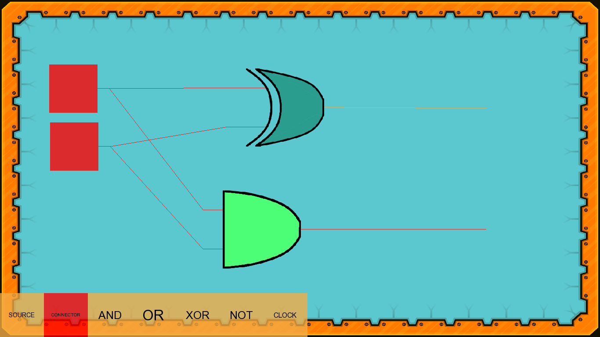
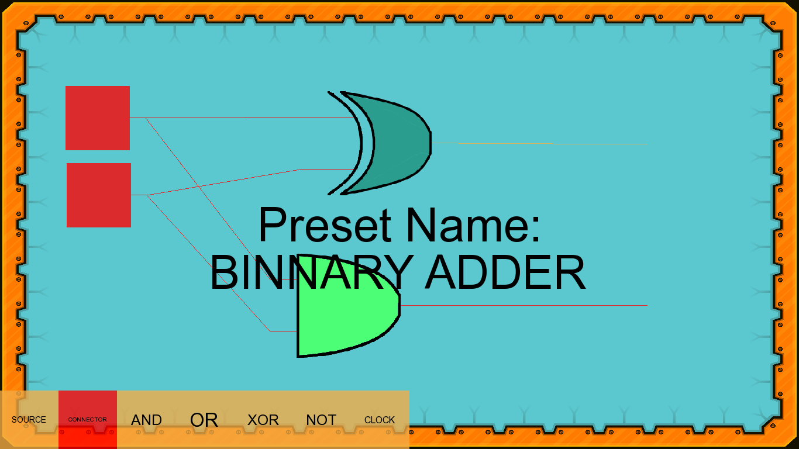

# Binary-Circuits

<h1> Description </h1>
  
 A simulator for binary circuits, that helps you bettery understand how computers and circuits work and help you develop, test and save simple circuits.

<h1> Preview </h1>
<h2> Create and test a circuit</h2>

<h2> Save the circuit</h2>

<h2> Show your circuits to others</h2>

<h1> Author </h1>

Lorin Budaca - lorinbudaca@gmail.com

